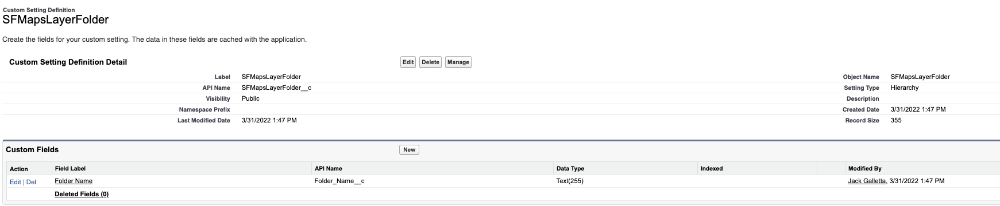

<h1 align="center">PointInPolygon Lead Trigger</h1>
<p align="center">This package contains an apex trigger and class that determines which Salesforce Maps layer that a given address resides in. The name of the SF Maps layer is stored in a custom field on the lead object called inLayer__c.  This package uses 2 methods from <a href="https://developer.salesforce.com/docs/atlas.en-us.maps_developer_guide.meta/maps_developer_guide/maps_apex_pointinpolygon.htm">this SF Maps developer documentation</a> to do so.  The SF Maps API Geocode method converts an address field into Lat/long and the PointInPolygon method determines the layer containing those coordinates. </p>

<!-- Sections below are Optional -->

---

## Summary

The original purpose of this component was to replace an old solution that cycled through a set of hard coded ESRI layers.  This improved solution allows for the dynamic addition of new layers in Salesforce Maps, modification of existing layers, and deletion of layers all without having to modify the code.  By using a custom setting in Salesforce to store the folder name, users only have to modify a single value in Salesforce to point this code towards any Salesforce Maps layer folder.

<b>Click Below to Watch a Brief Video Overview</b>

[](https://www.youtube.com/watch?v=scIZWILpQRs)

## Data Model Setup

There are only two additions that need to be made to an existing Salesforce org in order for this component to work.  

First on the lead object, a custom text Field called inLayer__c must be created to store the resulting layer value in.

Second, Creation of a custom setting called SFMapsLayerFolder__c with a single text field of Folder_Name__c.  This setting is used to store the corresponding folder of layers that you want to point the code towards.  This setting removes the need to edit any code when you want to change the folder containing the layers.  See the below image on the setup of the custom setting.



## Code Setup

With the data model changes made, our code should ideally be able to work right away once plugged into the org, but there are a few important parts that should be noted.

First, please note that the GeocodeAddress class has to be run asychronously.  The use of the Salesforce Maps API methods requires this by design so testing is much more of a pain because of this.  In order to test our code, we need to create something known as a <a href="https://developer.salesforce.com/docs/atlas.en-us.apexcode.meta/apexcode/apex_classes_restful_http_testing_httpcalloutmock.htm">mock class</a>.  This class essentially fakes the future async callout from apex and returns a hard coded response for testing purposes.  See GeocodeMockTester for an example, but please note that you will need to create your own Mock response in order to work in your org.

Lines 25-29 of GeocodeAddress.cls are essentially taking our address, converting it to lat/long, and then spitting it back out.  Some additional data quality checks and regex stuff is done just below it to format it for our next step.
```
  // Call the Geocode() method with the address.
  Map<String, Object> response = maps.API.Geocode(options);
  
  // Log the resulting geographical coordinates and formatted address. 
  myData = response.get('data');
```

The other key piece of this code occurs on lines 80-84 and line 90, where we built our request for the PointInPolygon method, and then pass it in to check which layer our code resides in.

```
  Map<String, Object> request = new Map<String, Object> {
  'version' => '2',
  'points' => coordinateList,
  'MATerritoryIds' => MATerritoryIds
  };
```
```
  Map<String,Object> responselayer = maps.Api.PointInPolygon(request);
```

## Maintainer

Jack Galletta, Public Sector Solution Engineer

Please feel free to Slack me with any questions about setup, configuration, or general improvements to the project.
