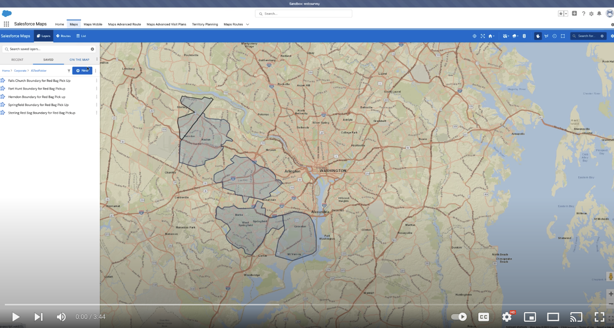

<h1 align="center">PointInPolygon Lead Trigger</h1>

This package contains an apex trigger and class that determines which Salesforce Maps layer that a given address resides in. The name of the SF Maps layer is stored in a custom field on the lead object called inLayer__c.  This package uses 2 methods from <a href="https://developer.salesforce.com/docs/atlas.en-us.maps_developer_guide.meta/maps_developer_guide/maps_apex_pointinpolygon.htm">this SF Maps developer documentation</a> to do so.  The SF Maps API Geocode method converts an address field into Lat/long and the PointInPolygon method determines the layer containing those coordinates. 

<!-- Sections below are Optional -->

---

## Summary

The original purpose of this component was to replace an old solution that cycled through a set of hard coded ESRI layers.  This improved solution allows for the dynamic addition of new layers in Salesforce Maps, modification of existing layers, and deletion of layers all without having to modify the code.  By using a custom setting in Salesforce to store the folder name, users only have to modify a single value in Salesforce to point this code towards any Salesforce Maps layer folder.

<b>Click Below to Watch a Brief Video Overview</b>

## Data Model Setup

There are only two additions that need to be made to an existing Salesforce org in order for this component to work.  

First on the lead object, a custom text Field called inLayer__c must be created to store the resulting layer value in.

Second, Creation of a custom setting called SFMapsLayerFolder__c with a single text field of Folder_Name__c.  This setting is used to store the corresponding folder of layers that you want to point the code towards.  This setting removes the need to edit any code when you want to change the folder containing the layers.

## Code Setup

With the data model changes made, our code should ideally be able to work right away once plugged into the org, but there are a few caveats and important pieces of the code that you may need to modify.

## Maintainer

Jack Galletta, Public Sector Solution Engineer

Please feel free to Slack me with any questions about setup, configuration, or general improvements to the project.
